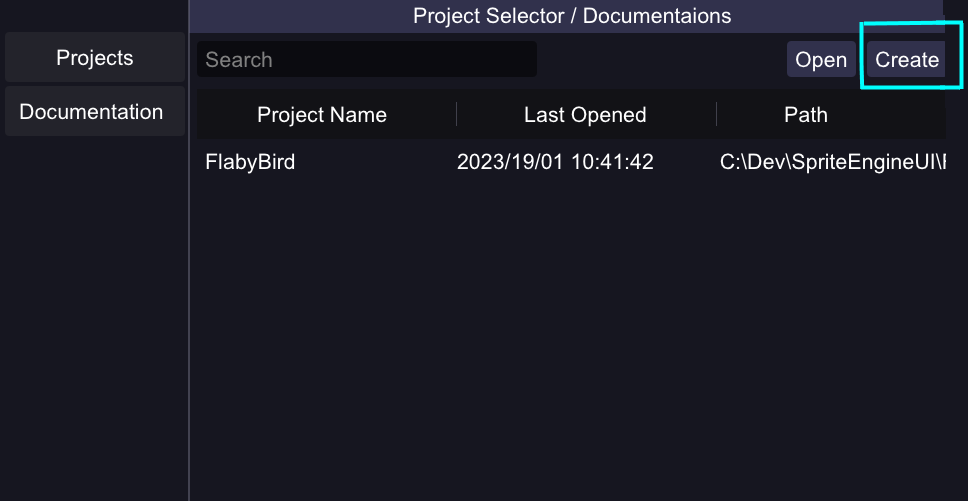
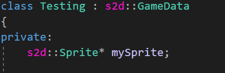
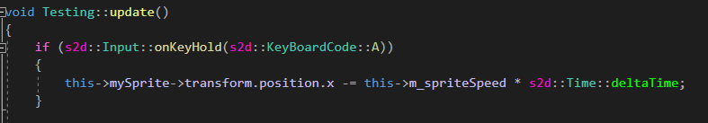

# Welcome To Sprite Egnine

This Project is a simple **2D Game Engine** designed to be fully understand by one Person.

## Features

- **UI Editor**
- **Box Collision Detection**
- **Parent-Child Collision Stopping** 
- **Physics**
- **Animations**
- **Scripting with C++** 

----    
## Enhancements
- **Sound Manager**
- **Animation supporting UI Editor**
- **Automatic project builder**

---

## Getting Started

You can get started by downloading the Engine folder [here](https//github.com)

You can find a Introduction to the engine on [YouTube](https://www.youtube.com/watch?v=pnCD5dKhpmg)

1. **Create a Project**

    In the folder open the .exe and create a new project by clicking on the create button. 

    

    A File Dialog will open, select where u want to create the project and hit the '**+**' button.

    All the files from the **template** folder will be automatically copied to the location the user selected.

    The folder will have the name the user selected, the **.sln** file and the **.exe** wont have the same name as the **project name**. 

    I'am **looking to add** a feature where u can build the project in a folder with it's name, containing all the dll's and **renamed files**. 

2. **How Do I Script My Sprites?**

   In the Game Engine you can right click in the Asset folder and select **New -> C++ Script**, this will create a new Script containing the **update** and **start** functions.
   (You can find the docs the the functions in the engine)

   You can create a new **Sprite ptr** in your class:

   

   You can give the **Sprite ptr** a address by calling the **s2d::Sprite::getSpriteByName("name");** function, to search for a sprite with the name **'name'**. This will return a **'nullptr'** or the adress to this sprite.

    

    Finally you can change the properties of the sprite using the **update** function for example: 

    

   

