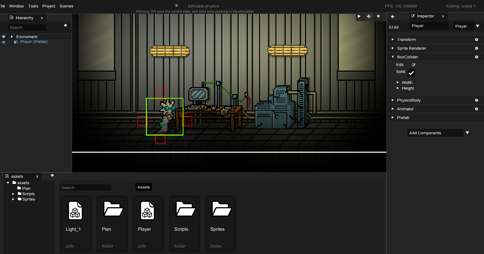
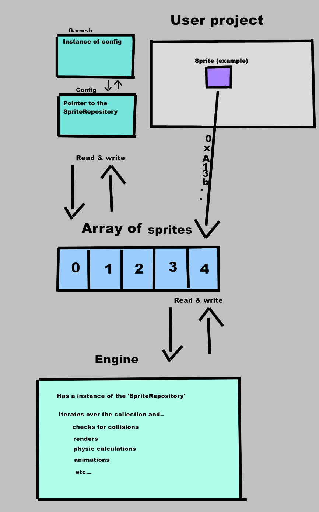

# Welcome To Sprite Engine

Welcome to Sprite Engine, a user-friendly **2D Game Engine** designed for solo developers who want a straightforward yet powerful tool.

## Table of Contents
1. [Welcome To Sprite Engine](#welcome-to-sprite-engine)
2. [Tools Used](#tools-used)
3. [Features](#features)
4. [Enhancements](#enhancements)
5. [Quick overview](#quick-overview)
6. [Getting Started](#getting-started)
7. [The Engine](#the-engine)

## Tools Used
- **SFML**
- **Dear ImGui**
- **CMake**
- **Rene**

## Features
- **UI Editor**
- **Scene Creation**
- **Box Collision Detection**
- **Parent-Child Collision Stopping**
- **Physics**
- **Animations (supported by the editor)**
- **Scripting with C++**
- **Project Creator**
- **Automatic Project Builder**
- **Lighting**
- **Prefabs**
- **Simulation in editor**

## Enhancements
- **Sound Manager**
- **Additional C++ Functions**
- **Cleaner Design**
- **Box Collider Rotation**

## How to build

- Navigate to the engine directory `cd Engine`
- Create a Build directory `mkdir Build`
- Navigatge in the Build dir `cd Build`
- Make sure to have CMake installed and run this command `cmake ..`
- Make sure to have the Editor as startup project

## Getting Started

**Note:** This file may be outdated as I am working solo on this engine.

To begin, clone this github repository.

Watch an introduction to the engine on [YouTube](https://www.youtube.com/watch?v=pnCD5dKhpmg).

1. **Create a Project**
   - Click the `create` button to initiate a new project.
   - In the file dialog, choose the project location and press the `+` button.
   - All files from the **template** folder will be copied to the selected project location.
   - The project folder takes the user-selected name, while the **.sln** and **.exe** files have different names.

   *Tip:* Pressing `build` or `CTRL + B` in the engine will automatically build the .exe into a folder, avoiding manual resource/DLL handling.

2. **How Do I Script My Sprites?**

    The engine calls the `update` and `start` methods of the `Game` class only once. If you create a new script, you need to invoke the `update` method from the script within the `Game` class. If you wish to share instances, simply pass them in the `update` methods or set a pointer to them in the `start` method. To access a sprite, call `this->config.ptr_sprites->getSpriteWithName("name");` This method returns a pointer to the sprite in the `SpriteRepository`. You can now perform various operations with the sprite. Please be aware that the engine still has many bugs.

   - Ensure you've built the Assets project manually using Visual Studio (Buildsystem is coming).
   - Right-click the hierarchy window and select **New -> Sprite**.
   - In the game engine, right-click on the asset folder and choose **New -> C++ Script** to create a script with **update** and **start** functions.
   - Create a new **Sprite ptr** in your class:

     ```C++
     class Game : public spe::IScript
     {
     private:
         Sprite* m_sprite;
     }
     ```

   - Assign an address to the **Sprite ptr** using:

     ```C++
     void Game::start()
     {
         this->m_sprite = this->configptr_sprites->getSpriteWithName("name");
     }
     ```

   - Change sprite properties in the **update** function:

     ```C++
     void Game::update()
     {
         if(Input::onKeyHold(KeyBoardCode::A))
         {
             this->m_sprite.transform.setPosition(spe::Vector(x, y))
         }
     }
     ```

3. **How do the sprites get managed?**
   - All sprites are managed by an object called `SpriteRepository`.
   - Add sprites to the scene using the repository:

     ```C++
     void Game::start()
     {
         Sprite* spr = new Sprite();
         this->config.ptr_sprites.add(spr);
     }
     ```

   - Activate necessary components for basic collision detection:

     ```C++
     void Game::start()
     {
         Sprite* spr = new Sprite();
         spr->collider.exist = true;
     }
     ```

# The Engine

**Picture of the Engine**


This game is currently being developed, github link: 
[DasynceSE](https://github.com/jkatsanis/DasynceSE.git)

**How does the SpriteRepository work?**

